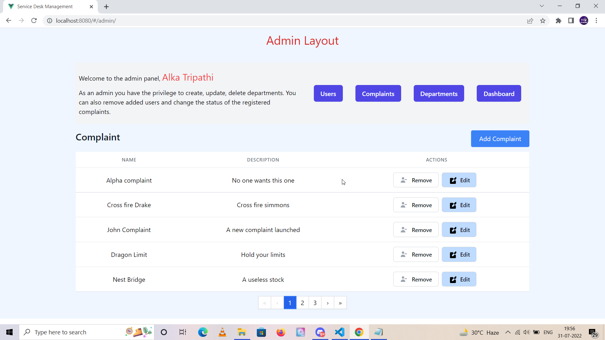
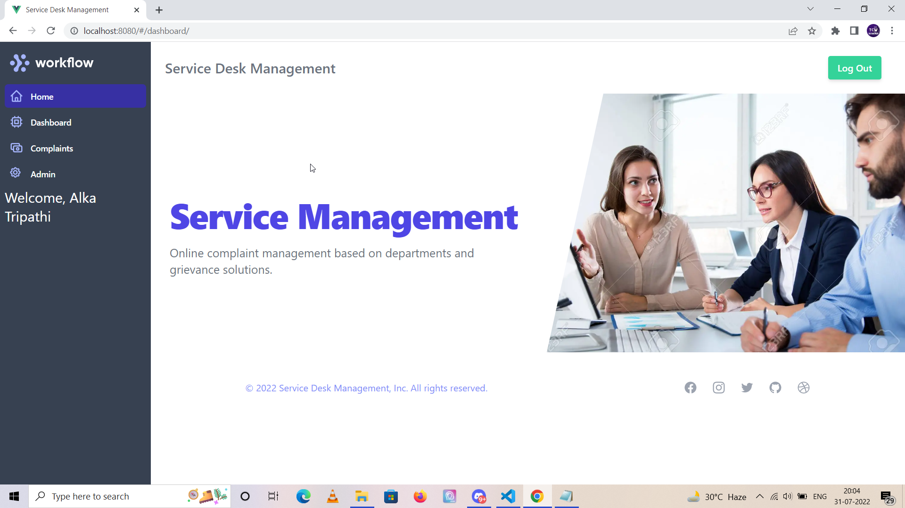

# Service Desk Management Application


## Project Briefing

This is an Service Desk Management Software created in Vue, Express and MongoDB. Many corporations have their internal complaint resolution department for their employees to solve grievances. This is a sample app for one such hypothetical organization.

## Built With

* [Express](https://expressjs.com/)
* [Vue](https://vuejs.org/)
* [MongoDB](https://www.mongodb.com/)
* [Vuex](https://vuex.vuejs.org/)
* [Tailwind CSS](https://tailwindcss.com/)

## Authors

* **Amit Prafulla (APFirebolt)** - (https://apgiiit.com/)

## Project setup

Simply install node modules for both frontend and backend, the project is already configured to serve build content files in production which is generated by Vue which resides inside the build folder.

Concurrently, package is used for development and allows us to launch both frontend and back-end in one go using single command. Proxy is used for API calls made to the Express server inside the Vue application using the config file.

```
npm install
npm run dev
```

For production, build the frontend of the app and then run the backend app only. 

```
npm run build
npm start
```

## Database Architecture

The app contains users, complaints and departments models. Departments exist for segregation of complaints based on department. There is a 'userType' attribute inside user model aside from generic fields like email and password. This 'userType' field can have two enum values - Staff and Member.

Currently, admin is assigned the role of assigning complaints to 'staff' users. Admin can add a staff user and from complaints panel inside admin section can assign complaints to individual staff users. Staff users would have the leverage to alter the status of the complaints.

Department just have two fields - Name and Description which are self explanatory. Only Admin users have the privilege to perform CRUD operations on department model.

## Project Features

- Complaint System for Organization and people working within the organization.
- Has an Admin Panel
- Users can add complaints and view status.
- Complaints are segregated by department, CRUD on departments can be performed by admin.

## Project Screenshots

Screenshots would be added as progress is made with this application. Some pages of the admin pages are displayed below



Screenshot of the Profile page. User would land on this page after logging in.




